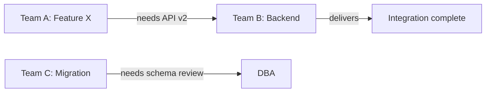

## Overview

Based on "Making Work Visible" by Dominica DeGrandis. Hidden dependencies are one of the five time thieves that kill delivery flow. The key insight: dependencies only become visible when you explicitly surface them as work items - not as footnotes in a ticket or assumptions in a plan. A dependency map exposes which teams are waiting on which, so you can sequence work and eliminate the invisible queue.

## Workflow

### Step 1: Gather the delivery inventory
Ask the user to list all active workstreams, epics, or initiatives currently in flight. For each item, capture:
- Name of the workstream
- Owning team
- Current status (not started / in progress / blocked / done)
- Target completion date

If the user provides a list, extract these fields. If they give a narrative, parse it into this structure before continuing.

### Step 2: Identify the dependency type for each workstream
For each workstream, ask: "What does this need from outside the team before it can proceed?" Classify each dependency:

| Type | Definition | Example |
|------|-----------|---------|
| **Sequential** | Team B cannot start until Team A finishes | API contract from backend before frontend builds |
| **Shared resource** | Both teams need the same person, system, or service | One DBA serving three teams |
| **External** | Waiting on a vendor, third party, or regulatory approval | Payment provider certification |
| **Knowledge** | Depends on expertise that lives in one person | Only one engineer knows the legacy auth system |

### Step 3: Build the dependency matrix
Create a table:

```
| Workstream | Needs From | Type | Status | Due Date | Risk |
|-----------|-----------|------|--------|----------|------|
| [Team A: Feature X] | [Team B: API v2] | Sequential | Blocked | [date] | HIGH |
| [Team C: Migration] | [DBA: schema review] | Shared resource | Waiting | [date] | MED |
```

Rate risk as:
- HIGH: dependency is on the critical path, already delayed, or owned by a single person
- MED: dependency exists but has a known resolution path
- LOW: dependency is confirmed and on track

### Step 4: Identify the critical path blockers
From the matrix, surface the top 3 dependencies that, if unresolved, will delay the overall program. For each:
- Name the owner responsible for resolving it
- State the specific action needed (not "coordinate with Team B" - "Team B needs to deliver API contract by [date]")
- Assign a resolution date

### Step 5: Generate the dependency map output
Produce two artifacts:

**Artifact 1: Dependency Summary Table** (paste into Confluence, Notion, or Jira)
```
DEPENDENCY MAP - [your program] - [date]
========================================
HIGH RISK (resolve this week)
- [Workstream X] is blocked by [Team Y / deliverable Z] - Owner: [name] - Due: [date]

MEDIUM RISK (monitor weekly)
- [Workstream A] waiting on [shared resource B] - Owner: [name] - Due: [date]

RESOLVED / ON TRACK
- [Workstream C] dependency confirmed with [Team D] - no action needed
```

**Artifact 2: Mermaid dependency diagram** (paste into Markdown or Notion)


Adapt the diagram to the user's actual workstreams. Use -->| label | syntax to name each dependency.

### Step 6: Recommend resolution actions
For each HIGH risk dependency, recommend one of:
- **Negotiate an earlier delivery date** with the upstream team
- **Create a stub or mock** so downstream work can proceed in parallel
- **Re-sequence** - move the dependent work out of the current cycle
- **Escalate** - surface to leadership if the dependency is outside the team's control

## Anti-Patterns

**1. Tracking dependencies as ticket comments**
Bad: "We need API from backend" buried in a Jira comment.
Good: A standalone dependency row in the matrix with an owner, due date, and risk rating.

**2. Mapping every dependency including obvious ones**
Bad: 40-row matrix including "frontend needs design mockups" for every ticket.
Good: Map program-level and cross-team dependencies only. Intra-team sequencing belongs in sprint planning.

**3. No owner on the resolution**
Bad: "Team A is blocked by Team B" with no named resolution owner.
Good: "[Name] from Team B will deliver [artifact] by [date]. [Name] from Team A is accountable for following up."

**4. Building the map and never updating it**
Bad: One-time dependency audit done at program kickoff, never revisited.
Good: Dependency map is a living artifact - reviewed in weekly program sync, statuses updated each cycle.

**5. Treating all dependencies as fixed**
Bad: "We can't start Feature X until Team B finishes."
Good: Ask first - can Feature X start with a stub? Can the API contract be agreed before the full implementation is done?

## Quality Checklist

- [ ] Every HIGH risk dependency has a named owner and resolution due date
- [ ] Dependency type is classified (sequential, shared resource, external, knowledge)
- [ ] Critical path blockers are called out separately from low-risk dependencies
- [ ] Mermaid diagram or visual representation is included
- [ ] Resolution action is specific - not "coordinate" but "deliver [artifact] by [date]"
- [ ] Map is scoped to program-level cross-team dependencies, not intra-team task sequencing
